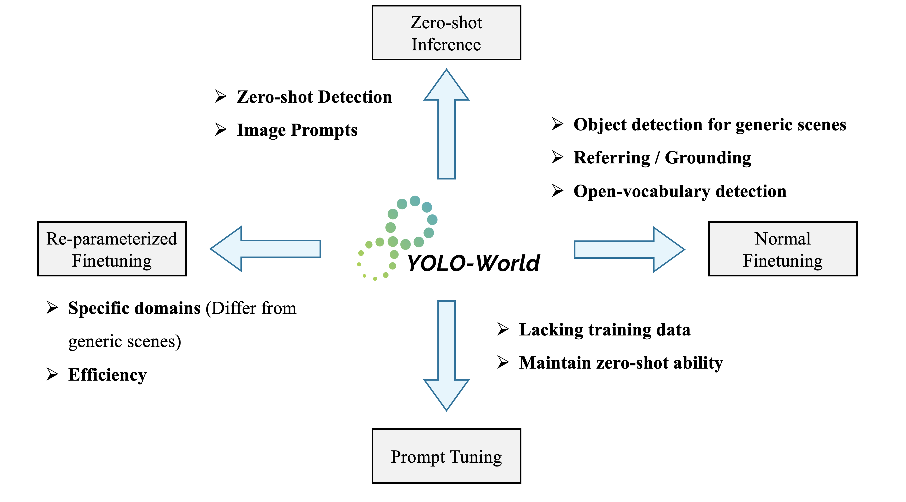

## 源码地址

```bash
https://github.com/AILab-CVC/YOLO-World
```

## Getting started

### 1. Installation

YOLO-World is developed based on `torch==1.11.0` `mmyolo==0.6.0` and `mmdetection==3.0.0`. Check more details about `requirements` and `mmcv` in [docs/installation](./docs/installation.md).

#### Clone Project 

```bash
git clone --recursive https://github.com/AILab-CVC/YOLO-World.git
```
#### Install

```bash
pip install torch wheel -q
pip install -e .
```

### 2. Preparing Data

We provide the details about the pre-training data in [docs/data](./docs/data.md).


## Training & Evaluation

We adopt the default [training](./tools/train.py) or [evaluation](./tools/test.py) scripts of [mmyolo](https://github.com/open-mmlab/mmyolo).
We provide the configs for pre-training and fine-tuning in `configs/pretrain` and `configs/finetune_coco`.
Training YOLO-World is easy:

```bash
chmod +x tools/dist_train.sh
# sample command for pre-training, use AMP for mixed-precision training
./tools/dist_train.sh configs/pretrain/yolo_world_l_t2i_bn_2e-4_100e_4x8gpus_obj365v1_goldg_train_lvis_minival.py 8 --amp
```
**NOTE:** YOLO-World is pre-trained on 4 nodes with 8 GPUs per node (32 GPUs in total). For pre-training, the `node_rank` and `nnodes` for multi-node training should be specified. 

Evaluating YOLO-World is also easy:

```bash
chmod +x tools/dist_test.sh
./tools/dist_test.sh path/to/config path/to/weights 8
```

**NOTE:** We mainly evaluate the performance on LVIS-minival for pre-training.

## Fine-tuning YOLO-World

<div align="center">

</div>


<div align="center">
<b><p>Chose your pre-trained YOLO-World and Fine-tune it!</p></b> 
</div>


YOLO-World supports **zero-shot inference**, and three types of **fine-tuning recipes**: **(1) normal fine-tuning**, **(2) prompt tuning**, and **(3) reparameterized fine-tuning**.

* Normal Fine-tuning: we provide the details about fine-tuning YOLO-World in [docs/fine-tuning](./docs/finetuning.md).

* Prompt Tuning: we provide more details ahout prompt tuning in [docs/prompt_yolo_world](./docs/prompt_yolo_world.md).

* Reparameterized Fine-tuning: the reparameterized YOLO-World is more suitable for specific domains far from generic scenes. You can find more details in [docs/reparameterize](./docs/reparameterize.md).

## Deployment

We provide the details about deployment for downstream applications in [docs/deployment](./docs/deploy.md).
You can directly download the ONNX model through the online [demo](https://huggingface.co/spaces/stevengrove/YOLO-World) in Huggingface Spaces 🤗.

- [x] ONNX export and demo: [docs/deploy](https://github.com/AILab-CVC/YOLO-World/blob/master/docs/deploy.md)
- [x] TFLite and INT8 Quantization: [docs/tflite_deploy](https://github.com/AILab-CVC/YOLO-World/blob/master/docs/tflite_deploy.md)
- [ ] TensorRT: coming soon.
- [ ] C++: coming soon.

## Demo

See [`demo`](./demo) for more details

- [x] `gradio_demo.py`: Gradio demo, ONNX export
- [x] `image_demo.py`: inference with images or a directory of images
- [x] `simple_demo.py`: a simple demo of YOLO-World, using `array` (instead of path as input).
- [x] `video_demo.py`: inference YOLO-World on videos.
- [x] `inference.ipynb`: jupyter notebook for YOLO-World.
- [x] [Google Colab Notebook](https://colab.research.google.com/drive/1F_7S5lSaFM06irBCZqjhbN7MpUXo6WwO?usp=sharing): We sincerely thank [Onuralp](https://github.com/onuralpszr) for sharing the [Colab Demo](https://colab.research.google.com/drive/1F_7S5lSaFM06irBCZqjhbN7MpUXo6WwO?usp=sharing), you can have a try 😊！

## Acknowledgement

We sincerely thank [mmyolo](https://github.com/open-mmlab/mmyolo), [mmdetection](https://github.com/open-mmlab/mmdetection), [GLIP](https://github.com/microsoft/GLIP), and [transformers](https://github.com/huggingface/transformers) for providing their wonderful code to the community!

## Citations
If you find YOLO-World is useful in your research or applications, please consider giving us a star 🌟 and citing it.

```bibtex
@inproceedings{Cheng2024YOLOWorld,
  title={YOLO-World: Real-Time Open-Vocabulary Object Detection},
  author={Cheng, Tianheng and Song, Lin and Ge, Yixiao and Liu, Wenyu and Wang, Xinggang and Shan, Ying},
  booktitle={Proc. IEEE Conf. Computer Vision and Pattern Recognition (CVPR)},
  year={2024}
}
```

## Licence
YOLO-World is under the GPL-v3 Licence and is supported for commercial usage. If you need a commercial license for YOLO-World, please feel free to contact us.
# CV
